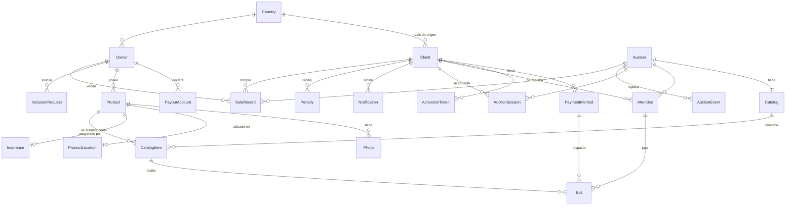

# Modelo de datos

> Fuente de verdad de entidades, enums y relaciones. El `schema.prisma` del backend **debe** reflejar
> este documento. Si algo cambia acá, se actualiza el schema (y viceversa) en la misma feature.

ORM: **Prisma**. Motor en desarrollo: **SQLite** (archivo local, cero setup). El diseño se mantiene
**agnóstico** para migrar a PostgreSQL en Entrega 3 sin cambios de modelo (evitar features SQLite-only).

---

## 1. Enums

```
Category           = common | special | silver | gold | platinum   // orden ascendente
Currency           = ARS | USD
AuctionStatus      = scheduled | open | closed                      // 'scheduled' agregado (corrección E1)
PaymentMethodType  = bank_account | credit_card | certified_check
PaymentStatus      = pending | verified | rejected                  // medios de pago
ItemStatus         = pending | active | pending_confirmation | sold | unsold
InclusionStatus    = pending | under_inspection | accepted | rejected | proposal_sent | proposal_rejected
PenaltyStatus      = pending | paid
SalePaymentStatus  = pending | paid | failed                        // pago de la compra ganada (corrección E1)
NotificationType   = admission | auction_winner | inclusion_proposal | penalty | item_rejected | info
AuctionEventType   = new_bid | item_opened | item_closed | item_sold | item_unsold | auction_ended
```

**Orden de categorías** (para "categoría de subasta ≤ categoría de cliente"):
`common(0) < special(1) < silver(2) < gold(3) < platinum(4)`. Guardar el orden en código (no en DB).

---

## 2. Entidades

### Personas

> El OpenAPI modela un `Person` base con `allOf` para `Client` y `Owner`. Prisma **no tiene herencia**:
> se **aplanan** los campos comunes (`document`, `name`, `address`, `active`, `photoUrl`) en cada tabla.
> Un mismo humano puede existir como `Client` y como `Owner`; se vinculan opcionalmente por `document` (DNI).

#### `Client` (postor)
| Campo | Tipo | Notas |
|-------|------|-------|
| `id` | int PK | |
| `document` | string, **unique** | **DNI**. Identificador de login. |
| `firstName`, `lastName` | string | |
| `email` | string, unique, nullable | |
| `passwordHash` | string, nullable | Se setea en activación (etapa 2). |
| `address` | string, nullable | Domicilio legal. |
| `photoUrl` | string, nullable | |
| `idCardFrontUrl`, `idCardBackUrl` | string, nullable | Fotos del documento (etapa 1). |
| `countryId` | FK → Country, nullable | |
| `admitted` | bool, default false | La empresa lo admite tras verificar. |
| `category` | Category, nullable | Asignada al admitir. |
| `blocked` | bool, default false | Bloqueado por multa impaga / justicia. |
| `active` | bool, default true | Baja lógica. |
| `verifierId` | int, nullable | Operador que lo verificó. |
| `createdAt`, `updatedAt` | datetime | |

`hasVerifiedPaymentMethod` es **derivado** (existe ≥1 `PaymentMethod` con `status = verified`). No se persiste.

#### `Owner` (dueño)
| Campo | Tipo | Notas |
|-------|------|-------|
| `id` | int PK | |
| `document` | string, unique | DNI. |
| `name`, `address`, `photoUrl`, `active` | | Campos de persona. |
| `countryId` | FK → Country, nullable | |
| `financialVerification`, `judicialVerification` | bool | |
| `riskRating` | int (1..6) | |
| `verifierId` | int | |

#### `Country`
`id` PK · `name` · `shortName?` · `capital` · `nationality` · `languages`.

### Medios de cobro/pago

#### `PaymentMethod` (del cliente)
`id` · `clientId` FK · `type` (PaymentMethodType) · `currency` · `detail` · `bank?` · `countryId?` ·
`reservedAmount?` (monto reservado / del cheque certificado) · `status` (PaymentStatus, default `pending`) ·
`rejectionReason?` · `createdAt`.

#### `PayoutAccount` (cuenta de cobro del dueño)
`id` · `ownerId` FK · `bank` · `countryId?` · `currency` · `cbuOrIban` · `accountHolder` ·
`declaredAt` (datetime). **Debe declararse ANTES del inicio de la subasta.**

### Subasta y catálogo

#### `Auction`
| Campo | Tipo | Notas |
|-------|------|-------|
| `id` | int PK | |
| `startsAt` | datetime | |
| `status` | AuctionStatus, default `scheduled` | scheduled → open → closed |
| `currency` | Currency | No bimonetaria. |
| `category` | Category | Define quién puede acceder. |
| `auctioneerId` | int, nullable | Rematador/martillero. |
| `location` | string, nullable | |
| `attendeeCapacity` | int, nullable | |
| `hasWarehouse` | bool | |
| `ownSecurity` | bool | |
| `streamingUrl` | string, nullable | Servicio externo. |
| `isCollection` | bool | |
| `collectionName` | string, nullable | |
| `version` | int, default 0 | **Contador incremental** para polling (sube con cada evento). |
| `currentItemId` | FK → CatalogItem, nullable | Ítem que se está rematando ahora (secuencial). |

#### `Catalog`
`id` · `description` · `auctionId` FK (1:1 con Auction) · `responsibleId`.

#### `Product` (bien físico)
`id` · `date?` · `available` (bool) · `catalogDescription?` · `fullDescription` (texto/URL ficha) ·
`reviewerId` · `ownerId` FK · `insurancePolicy?` (FK → Insurance.policyNumber) · `pieceCount` (default 1, ej. juego de 18) ·
`artist?` · `historicalDate?` · `history?`.

#### `Photo`
`id` · `productId` FK · `photoUrl`. (Inclusión requiere **≥ 6** fotos.)

#### `ProductLocation`
`productId` PK/FK (1:1) · `warehouse` · `address` · `receivedAt`.

#### `Insurance`
`policyNumber` PK · `company` · `combinedPolicy` (bool, cubre varias piezas del mismo dueño) · `amount` (según precio base).

#### `CatalogItem` (Ítem / Lote)
| Campo | Tipo | Notas |
|-------|------|-------|
| `id` | int PK | |
| `catalogId` | FK → Catalog | |
| `productId` | FK → Product | |
| `lotNumber` | int | **Orden secuencial** dentro de la subasta. |
| `basePrice` | float | Precio base (visible solo a registrados). |
| `commission` | float | |
| `status` | ItemStatus, default `pending` | pending → active → pending_confirmation → sold/unsold |
| `auctioned` | bool, default false | Ya pasó por el martillo. |

`bestBid`, `minBidAllowed`, `maxBidAllowed` son **derivados** (ver `F05`). No se persisten.

### Participación en vivo

#### `Attendee` (registro de cliente en una subasta)
`id` · `auctionId` FK · `clientId` FK · `bidderNumber` (int, **secuencial por subasta**, asignado por el sistema).
**Único** (`auctionId`, `clientId`) y (`auctionId`, `bidderNumber`).

#### `AuctionSession` (conexión en vivo)
`id` · `auctionId` FK · `clientId` FK · `startedAt` · `endedAt?` · `active` (bool).
**Invariante:** un cliente tiene **a lo sumo 1** sesión `active = true` en todo el sistema.

#### `Bid` (puja)
`id` · `itemId` FK → CatalogItem · `attendeeId` FK → Attendee · `amount` (float) · `winner` (bool, default false) ·
`paymentMethodId` FK · `idempotencyKey` (string, **unique**) · `timestamp`.
Se guardan **todas** las pujas **en orden** (`timestamp` + `id`).

#### `AuctionEvent` (bitácora para `lastEvent` del polling)
`id` · `auctionId` FK · `type` (AuctionEventType) · `data` (JSON) · `createdAt`. El más reciente alimenta
`live-status.lastEvent`. Cada evento incrementa `Auction.version`.

### Inclusión, ventas, multas, notificaciones

#### `InclusionRequest`
`id` · `ownerId` FK · `productId` FK · `itemDescription` · `ownershipDeclared` (bool, **debe ser true**) ·
`legalityDeclared` (bool, **debe ser true**) · `status` (InclusionStatus) · `rejectionReason?` ·
`proposedBasePrice?` · `proposedCommission?` · `proposedAuctionId?` · `returnShippingCost?` · `createdAt`.

#### `SaleRecord` (registro de venta)
`id` · `auctionId` · `ownerId` · `productId` · `clientId` · `amount` · `commission` · `shippingCost?` ·
`pickupInPerson` (bool, default false; si true **pierde seguro**) · `shippingAddress?` · `paymentMethodId` ·
`boughtByCompany` (bool; true si nadie pujó y la empresa compró al base) ·
`paymentStatus` (SalePaymentStatus, default `pending`) · `paidAt?` · `createdAt`.

#### `Penalty` (multa)
`id` · `clientId` FK · `auctionId` · `itemId` · `amount` (10% del valor ofertado) ·
`status` (PenaltyStatus, default `pending`) · `createdAt` · `paidAt?`.

#### `Notification`
`id` · `clientId` FK · `type` (NotificationType) · `title` · `message` · `read` (bool, default false) ·
`payload?` (JSON) · `createdAt`.

### Auth

#### `ActivationToken` (etapa 2 del registro)
`id` · `clientId` FK · `token` (string, unique) · `expiresAt` · `usedAt?`. Se emite al admitir; el mail lo lleva.

#### `IdempotencyKey` (opcional, refuerza la confirmación de puja)
`key` PK · `clientId` · `scope` · `createdAt`. Alternativa: usar el `Bid.idempotencyKey` unique directamente.

---

## 3. Diagrama (ER simplificado)



---

## 4. Datos derivados (no se persisten)

| Dato | Cómo se calcula |
|------|-----------------|
| `Client.hasVerifiedPaymentMethod` | Existe `PaymentMethod` con `status = verified`. |
| `CatalogItem.bestBid` | `max(Bid.amount)` del ítem. |
| `CatalogItem.minBidAllowed` | `bestBid + 1% * basePrice` (o `basePrice` si no hay pujas). `null` para gold/platinum. |
| `CatalogItem.maxBidAllowed` | `lastBid + 20% * basePrice`. `null` para gold/platinum. |
| `Metrics.*` | Agregados sobre `Attendee`, `Bid`, `SaleRecord` (ver `F08`). |
| `Auction.attendeeCount` / `itemCount` | `count` de relaciones. |

---

## 5. Seed mínimo recomendado (desarrollo)

Para poder correr el circuito MVP sin admin manual: 1 `Country`, 1 `Client` admitido con categoría `gold`
y 1 `PaymentMethod` verificado, 1 `Owner`, 1 `Auction` `open` con `Catalog` y 2–3 `CatalogItem` (con
`Product` + fotos), 1 admin. Ver [`F00-setup.md`](./features/F00-setup.md).
